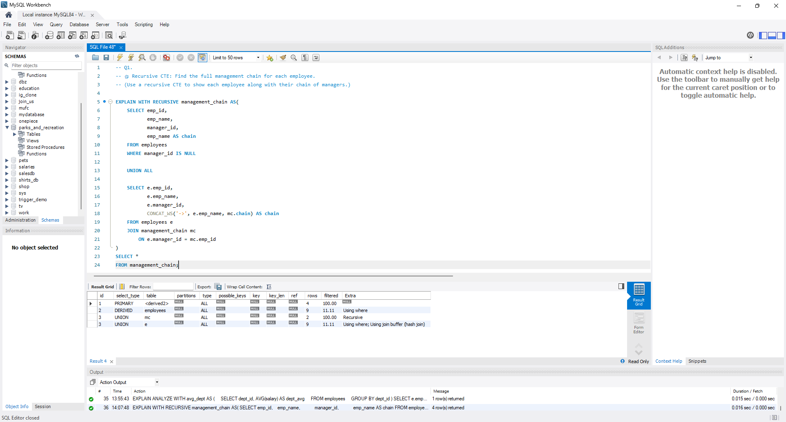

# 🧠 SQL Practice Collection

### Author: **Joel Osei**
### Database: **MySQL**

---

## 📘 Overview

This repository contains a complete collection of **SQL practice exercises** — from beginner to advanced — designed to build strong database querying and analytical skills.  
Each part focuses on a specific set of concepts, progressing in difficulty and complexity.

The exercises use the same consistent schema (`employees` and `departments` tables) and are designed for hands-on practice with **MySQL 8.0+**.

---

## 🧩 Topics Covered

- SELECT, WHERE, ORDER BY, and filtering
- Joins and Subqueries
- Aggregations and GROUP BY
- Window functions (RANK, LAG, NTILE)
- Common Table Expressions (CTEs)
- Recursive CTEs for hierarchy exploration
- Analytical queries and reporting
- Query optimization with EXPLAIN

---

```
## 🧩 Database Schema

### **`employees`**
| Column | Type | Description |
|:--------|:------|:------------|
| emp_id | INT | Unique employee ID |
| emp_name | VARCHAR | Employee name |
| salary | DECIMAL | Current salary |
| hire_date | DATE | Date of hire |
| manager_id | INT | References another employee (their manager) |
| dept_id | INT | References the department ID |

### **`departments`**
| Column | Type | Description |
|:--------|:------|:------------|
| dept_id | INT | Unique department ID |
| dept_name | VARCHAR | Department name |
```
---

## ⚙️ Setup

1. Ensure you have **MySQL 8.0+** installed (for window functions & CTEs).  
2. In MySQL Workbench or CLI, navigate to your project directory.  
3. Create the database schema and insert sample data:

```sql
SOURCE create_tables.sql;
SOURCE sample_data_tables.sql;
```
Then run queries from any part you wish to practice.

## 🗂️ Folder Structure
bash
Copy code
```
# 📁 SQL Practice Collection/
│
├── create_tables.sql
├── sample_data_tables.sql
├── README.md
│
├── Part 1 (Beginner)/
│   ├── beginner-sql-practice-part_1.sql
│   └── README.md
│
├── Part 2 (Intermediate)/
│   ├── intermediate-sql-practice-part_2.sql
│   └── README.md
│
├── Part 3 (Intermediate)/
│   ├── intermediate-sql-practice-part_3.sql
│   └── README.md
│
├── Part 4 (Advanced)/
│   ├── advanced-sql-practice-part_4.sql
│   └── README.md
│
├── Part 5 (Advanced)/
│   ├── advanced-sql-practice-part_5.sql
│   └── README.md
│
├── Part 6 (Advanced)/
│   ├── advanced-sql-practice-part_6.sql
│   └── README.md
│
├── Part 7 (Advanced)/
│   ├── advanced-sql-practice-part_7.sql
│   └── README.md
│
├── Part 8 (Advanced)/
│   ├── advanced-sql-practice-part_8.sql
│   └── README.md
│
└── Advanced SQL - With Recursive CTE/
    ├── advanced-sql-practice.sql
    └── README.md
```
## 📚 Practice Sections
Part 1 (Beginner)
Run Part 1 queries

Part 2 (Intermediate)
Run Part 2 queries

Part 3 (Intermediate)
Run Part 3 queries

Part 4 (Advanced)
Run Part 4 queries

Part 5 (Advanced)
Run Part 5 queries

Part 6 (Advanced)
Run Part 6 queries

Part 7 (Advanced)
Run Part 7 queries

Part 8 (Advanced)
Run Part 8 queries

Advanced SQL – With Recursive CTE
Run Recursive CTE queries

## 📊 Example Query Output

Here’s an example of a recursive CTE query visualized in MySQL Workbench:

### Example Query Result



## 💬 Feedback & Contributions
If you find this project helpful, feel free to star ⭐ the repo or open an issue with suggestions.
Contributions (new exercises, optimizations, or documentation updates) are always welcome!

## 🧠 About
This collection is a structured learning project built by Joel Osei,
designed to master SQL from fundamentals to advanced analytics.
It showcases a range of real-world problem-solving scenarios, ideal for:

- Technical interview preparation

- Data analysis exercises

 - Database design practice

- Building confidence in SQL fluency